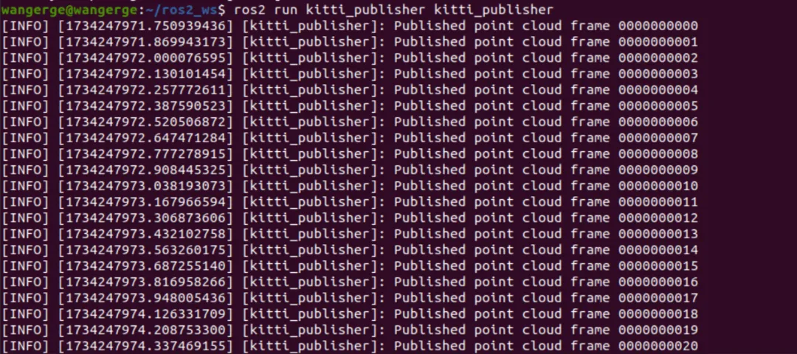
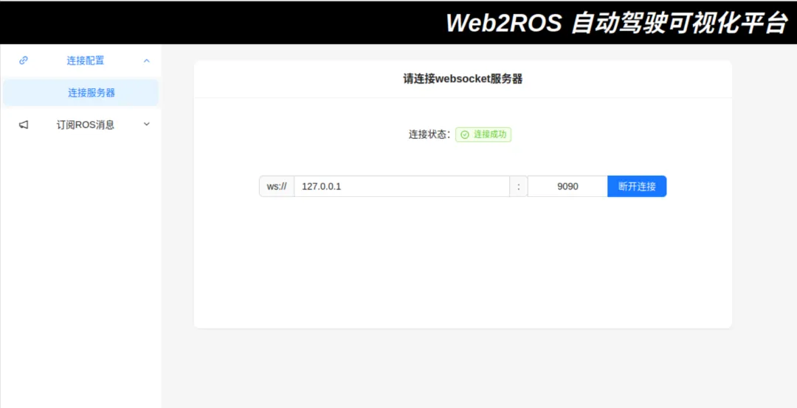

# 自动驾驶数据集可视化平台

# Get Start

Before run this project, you need run script `yarn install` to install the dependencies.

### `yarn start`

Runs the app in the development mode.\
Open [http://localhost:3000](http://localhost:3000) to view it in your browser.

# 环境与技术栈
- 操作系统版本: Ubuntu 20.04

- ROS版本: ROS 2

- 编程语言: C++

- 数据集: Kitti 自动驾驶数据集

- Web 相关技术栈:

- rosbridge_suite 作为ROS2和浏览器端交互的桥梁，使用WebSocket 数据传输;

- React 构建用户界面;

- roslib 处理 WebSocket 数据;

- Three.js 实现数据可视化;

## 过程

### 发布主题

### 启动Web前端页面

